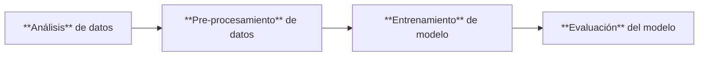

# Detectar texto generado con Inteligencia Artificial (LLM)

***Martín Cogo Belver***  

***Inteligencia Artificial II - Cursado 2023***

***Informe final***

***Facultad de Ingeniería Universidad de Cuyo***

## Introducción

El objetivo de este trabajo es utilizar modelos de machine learning enseñados durante el dictado de la materia AI II, específicamente aquellos enfocados en redes neuronales, con el fín de resolver un problema a elección.

Para este trabajo he decidido participar en un [Desafío] de la pagina [Kaggle]. El desafió cociste en un problema de clasificación donde se debe detectar si un texto ha sido generado con IA (Inteligencia Artificial) o no.

## Indice:
- [Propuesta](#propuesta)
- [Marco Teórico](#marco-teórico)
- [Diseño experimental](#diseño-experimental)
- [Conclusión](#conclusión)
- [Alcance](#alcance)
- [Referencias Bibliográficas y librerías](#referencias-bibliográficas-y-librerías)

## Propuesta 

Para resolver el tipo de problema planteado por del [desafío] hay modelos y técnicas que han surgido durante los últimos años que crecen en complejidad y costo computacional. Es debido a esto que para este trabajo pienso en enfocarme en modelos de poco costos con el fin de realizar la fase experimental. Esto principalmente debido a la carencia de recursos computacionales necesarios para poder realizar el entrenamiento de los modelos más complejos.

En la sección [*Marco Teórico*](#marco-teórico) se explican brevemente los conceptos teóricos que justifican la elección del modelo y las decisiones tomadas para el [*Diseño Experimental*](#diseño-experimental). En tal sección, explicamos principalmente los detalles relacionados con análisis inicial de datos, pre-procesamiento de datos, entrenamiento del modelo y evaluación de resultados.

## Marco Teórico

### Conjunto de datos des-balanciados

### Preprocesamiento de texto

### Modelos que se utilizan

Para el experimento utilizare lo que se conoce como NN(Neural Network) o MLP(Multilayer preceptron). [Dive into deep learning].

***Deifnición de Neurona***
***Definición de gradiente***
***Definicion de Bakward propagation***
**Token***
**Tokenización**
***Bag of words***
***embeddings***
***Gradiente desvaneciente***
***explocion del gradiente***
***Curva ROC, ROC AUC, ROC AUC_PR***

#### ROC AUC
An ROC curve (or receiver operating characteristic curve) is a plot that summarizes the performance of a binary classification model on the positive class. The x-axis indicates the False Positive Rate and the y-axis indicates the True Positive Rate.

$$
\text{TruePositiveRate} = \frac{\text{TruePositive}}{\text{TruePositive} + \text{FalseNegative}}
$$
$$
\text{FalsePositiveRate} = \frac{\text{FalsePositive}}{\text{FalsePositive} + \text{TrueNegative}}
$$
#### ROC AUC-PR
A precision-recall curve (or PR Curve) is a plot of the precision (y-axis) and the recall
(x-axis) for different probability thresholds.
$$
\text{Precision} = \frac{\text{TruePositive}}{\text{TruePositive} + \text{FalsePositive}}
$$
$$
\text{Recall} = \frac{\text{TruePositive}}{\text{TruePositive} + \text{FalseNegative}}
$$

## Diseño Experimental

Para esta face, principalmente seguí el siguiente workflow de Machine Learning.

### Obtención de datos

Según la descripción sobre el conjunto de [datos](https://www.kaggle.com/competitions/llm-detect-ai-generated-text/data) del [desafío]:
- El conjunto de datos esta compuesto por 10,000 ensayos, algunos escritos por estudiantes y otros escritos por large language models (LLMs).
- Todos los ensayos fueron escritos con 7 consignas, y para cada una de ellas se le brindado al estudiante un textos fuentes en formato Markdown. Aun que estos textos pueden o no haber sido brindados a los LMM para la generación.
- Solamente 2 de las 7 consignas se han incluido en el conjunto de datos de entrenamiento. Probablemente se desee generar más ensayos como datos de entrenamiento.

Los datos brindados por el concurso presentan un des-balance severo de clases.

***Graficas de desbalance de clases***

Según lo leído en la bibliografía [libro de invalance] existen técnicas y métricas que se pueden utilizar con conjuntos de datos des-balanceados. Pero, aun así debido al gran des-balance que hay en el conjunto de entrenamiento es imposible obtener un modelo que pueda generalizar bien con tan pocos datos.

Generar datos nuevos con LLM's en este caso no es trivial. Sobre todo porque es necesario tener acceso a LLM de pago como chatGPT para generar varios ejemplos.

Realize una investigación para correr el LLM open source llama-2 de manera local pero la cantidad de recursos computacionales necesarios para su funcionamiento es grande.

Por suerte uno de los participantes de la competencia se dedico a generar datos de entrenamiento exclusivos para este [desafío] y los puso a disposición de todos los participantes.
El conjunto de datos [drcat] incluso es utilizado en algunas de las mejores solución de la competencia.

### Análisis de Datos de Entrada

Claramente el conjunto de datos [drcat] posee una distribución de probabilidad de sus datos distinta a la del conjunto de datos del [desafío], por lo que el modelo resultante es necesario que presente buenas posibilidades de generalización. Esto esta planteado de esta manera como parte del desafío.

***Graficas de desbalance inicial vs balance de clases actual***

### Pre-procesamiento de datos

Según lo leído en la bibliografía [libro de features] para el pre-procesamiento de **texto** hay varias técnicas que se utilizan para trasformar un texto en representaciones vectoriales. Dependiendo de la cantidad de texto, y si para el problema a resolver es nesesario obtener una representación por palabra, por oración, por pararrafo o por documento. Se utilizan técnicas desde **Bag of words** hasta complejos modelos como ***word2vec*** que se encarga de crear [embeddings].

Analizando las características de nuestro problema, opte por utilizar embeddings como representación de cada documento.

Como resultado el pre-procesamiento de los datos de entrada sigue los siguientes pasos:
- [Conjunto de entrenamiento y de prueba](#separación-en-conjunto-de-entrenamiento-y-conjunto-de-prueba)
- [Tokenization](#tokenización)
- [Limpieza de datos](#limpieza-de-datos)
- [Creación de Embeddings](#representación-vectorial-embeddings)
- [Inferencia de características](#inferencia-de-algunos-atributos-extra)
- [Normalización](#normalización-del-conjunto-de-datos)

#### Separación en conjunto de entrenamiento y conjunto de prueba.

Para está separación usualmente se acostumbra una separación de 70% de entrenamiento y 30% de prueba. Pero inspirandome en la competecia realize una separación de 40% de entrenamiento y 60% de prueba.

Principalmente el concurso entregaba un conjunto de entrenamiento que concistia en el 10% del conjunto de total de datos y te incitaba a la generación de más datos. Luego solo se relaizaba pruebas sobre el 40% del conjunto de datos restante y se guardaba un 60% para el calculo de puntaje final luego de terminar la competencia.

#### Tokenización

Lo primero que debo realizar con cada texto que hay en el conjunto de datos es realizar una [tokenización]. 

Tomando inspiración del siguiente notebook referenciado en la competencia [Entrenar tu propio tekenizador](https://www.kaggle.com/code/datafan07/train-your-own-tokenizer), decidí crear un tokenizador utilizando la librería transformers de HuggingFace [tokenizers](https://huggingface.co/docs/transformers/main_classes/tokenizer).Concretamente el tokenizador basado de [ Byte-Pair Encoding Tokenizer](https://huggingface.co/learn/nlp-course/chapter6/5?fw=pt), que según es mencionado tiene ciertas propiedades que resultan utiles en nuestro problema (https://huggingface.co/docs/transformers/tokenizer_summary).

***Ejemplo de texto tokenizado***

#### Limpieza de datos

Además de eliminar los textos repetidos en el conjunto de datos inicial. Cuando se trabaja con texto, según el libro [feature engineearing], se realiza una eliminación de palabras que no aportan información al modelo, conocidas como ***stopwords***.

Para hacer este proceso de eliminación utilize de palabras utilize el conjunto de [stop words](https://www.nltk.org/search.html?q=stopwords) que están provistos por la libreria [Natural Language Toolkit](https://www.nltk.org/index.html)

***Imagen de stopwords***

#### Representación vectorial (Embeddings)

Teniendo en cuenta que la representación vectorial puede estar dada desde palabras hasta documentos, tome la decisión de obtener una representación por documento para facilitar la entrada de datos al modelo de ML elegido. 

Como se recomienza para obtener representaciones complejas de vectores para gran cantidad de texto se utilizan modelos pre-entrenados que permiten hacer esta conversion.

Para este trabajo elegi utilizar el modelo basado en word2vec, aunque existen otros.

***Modelos pre entrenados??? o son solo algoritmos complejos?????***

La biblioteca de gensim que provee modelos ya pre entrenados para mapear palabras a embeddings, el modelo se llama [word2vec](https://radimrehurek.com/gensim/models/word2vec.html).

Como este modelo pre entrenado solo permite crear una representación vectorial por palabras. Como extension de este modulo de gensim existe el modulo de la librería gesim [doc2vec](https://radimrehurek.com/gensim/models/doc2vec.html).

Este modelo a diferencia de word2vec permite crear representaciones de documentos completos y realizar inferencia para nuevos documentos no vistos durante la face de entrenamiento. Es decir que podemos obtener un nuevo embedding para conjuntos de datos nuevos.

Esto resulta especialmente util debido a que el conjunto de dedatos que se utilizara para test es totalmente desconocido.

Como resultado se generan embedding con 100 atributos, elegí esta cantidad de atributos de manera arbitraria ya que me pareció una cantidad suficiente.

***Imagen de vector con 100 parametros***

#### Inferencia de algunos atributos extra

Para probar si generabán mejores resultados cree 4 nuevos atributos para cada documentos donde espesificaba el la cantidad de tokens, cantidad de puntos, etc...

***Imagen de las columnas agregadas del dataset***

#### Normalización del conjunto de datos

Como parte del pre-procesamiento es importante realizar una normalización de los datos, para evitar problemas de [gradiente desvaneciente] o la [exploción del gradiente]. Por eso, por cada vector dividi sus componente por su modulo de tal manera que cada enbedding en realizad es un vector de modulo uno. Luego agregue un nuevo atributo con la norma correspondiente a cada vecto.
Finalmente tome todos los otros atributos que no eran parte del y normalización max-min.

***Imagen de como quedaron los valores del conjunto de datos***
***Imagen de describe del conjunto de datos***

### Entrenamiento

Para el entrenamiento he utilizado la tecnica de k-foldding que permite una mejor que según es reocmendaod en la bibliografía permite un entrenamiento menos sesgado y permite mejor generalización por parte dle modelo. Lo recomendado es k=10. Pero al inicialmente tratarse de un conjunto de datos desbalanciados he utilizado un tecnica de stratified-k-foldding que obtiene los folds siguiendo la distribuicón de datos incial para que de esta manera no tener problemás con la falta de instancias de una clase en algún fold.Para esto he utilizado la bilbioteca sikit learn.

Como framework para facilitar el entrenamiento y la definción de la arquitectura de la red neuronal he utilizado la libreria [keras].

PAra la qeuitectura tuve en cuenta que la cantidad de neuronas fuera suficientemente capaz de geenrar overfitt sobre lodatos. Unavez alcanzado ente punto comence a aplicar métodos de regularización para evitar esto. De ahí que peuda verse que hay regularización l1,l2 y una capa de dropout en la arquitectura.
Tras unas cuantas pruebas decidi unicament eutilizar la tecnica de dropout unicamente ya que la regularización l1 y l2 reusltaba en un overfitting del modelo. Por lo que utilizando un porcentaje de 40% de dropout en la capa intermedia fue suficientes como para onbtener resultados aceptables.

***Imagen de la Arquitectura***

Para seleccionar la cantidad de epocas durante las cuales se entrenaría el modelo he tenido en cuenta que el entrenamiento se realizara 10 veces con diferentes conjuntos de datos debido a los folds. Por lo que epochs=10, en realidad significa entrenar el modelo 100 epocas.

***imagen de compile***

Luego de realizar el entrenamiento del modelo realize una prueba sobre el total del conjunto de datos de entrenamiento y obtuve los siguientes resultados de las metricas

***AUC AUCRE***

*** Matriz de confución ***

### Verificación del rendimiento del modelo

#### Métricas

Para evaluar el rendimiento del modelo he elegido las métricas [ROC AUC] y [ROC AUC PR]. Además de que son las utilizadas en el [desafío], estas métricas tienen propiedades que sirven para el problema a resolver.

- No asumen la distribución del conjunto de prueba ***citar libro***
- Se utilizan en casos donde se presentan conjuntos de datos desvalanciados ya que se basan en la matriz de confución.
- el valor resultado que se obtiene del area bajo la curca ROC permite comparar distintos clasificadores. 

#### Resultados 

Finalmente realize la prueba sobre el conjunto de datos de prueba 
dandome un valor del 0.9
lo cual resulta alentador a primeras impresiones

***Pegar grafico***

Pero luego al probarlo sobre el conjunto de datos del concurso podemos ver que el
resultado es notablemente bajo.

***score del concurso**

## Conclusión

Si bien el rendimiento de la red neuronal más sencilla que podemos construir función bien para realizar la clasificación de textos en el conjunto de datos seleccionado. Podemós notar que existe una notable dificultad a la hora de realizar predicciones con datos no vistos. Es decir, que no generaliza lo suficientemente bien. 
Esto posiblemente se de debido a que el conjunto de datos tulizado en el entrenamiento y en la validación tienen una distribución de probabilidad muy diferente a la que puede encontrarse en el conjunto de datos que hay en la competencia. es por eso que se han obtenido puntajes tan bajos
el mejor fue de 0.65. y podemso concluir que el limite de esta solución se encuentr en el modelo mismo ya que las mejores soluciones propuestas en el concurso todos han sido utilizando transformes, los cuales justamente  han demostrado un mejor rendimiento en generalización que las demás tecnicas vistas.

### Alcance

Por lo investigado y las soluciones propuestas por los participantes del concurso, la mejor solución es utilizar modelos de transformes pre entrenados como BERT, distilBERT incluso la mejor solución propuesta utiliza un transformer pre-entrenado llamado distilroBERTa. Estos modelos requieren gran cantidad de poder de computo que excede incluso los que se encuentran disponibles de manera gratuita por [colab](https://colab.research.google.com/).

Se realizarón experimentos con NN y poco con CNN. 
Pero las pruebas con modelos como RNN y transformers pre entrenados no han sido posibles de realizar debido a la falta de recursos de hardware, que incluso superan las brindadas por google colab. 

Las mejores soluciónes de la comeptencias proponen realizar una tokenización de los textos y luego alimentar a bert o distilbert con estos datos, para que genere una clasificaciones. Esto ha dado resultados en la competencia con un puntaje mayor a 0.96.

## Referencias Bibliográficas y Librerías

### Fuentes Primarias

- [Imbalanced Classification with Python]
- [Feature Engineering for Machine Learning]
- [Dive into deep learning]
- [Art of feature engineering]

[Imbalanced Classification with Python]:https://machinelearningmastery.com/imbalanced-classification-with-python/

[Feature Engineering for Machine Learning]:https://www.oreilly.com/library/view/feature-engineering-for/9781491953235/

[Dive into deep learning]:https://d2l.ai/

[Art of feature engineering]:https://artoffeatureengineering.com/

### Notebooks

- [Train your own Tokenizer]

[Train your own Tokenizer]:https://www.kaggle.com/code/datafan07/train-your-own-tokenizer

## Librerías y frameworks

- [Pandas]
- [Numpy] 
- [Matplotlib]
- [Stopwords] 
- [Doc2vec]
- [StratifiedKFold] 
- [Resample]
- [Metrics module]
- [Tokenizers]
- [Transformers]
- [Keras]

[Kaggle]:https://www.kaggle.com/
[Desafío]:https://www.kaggle.com/competitions/llm-detect-ai-generated-text  
[Nuevo conjunto de datos]:https://www.kaggle.com/datasets/thedrcat/daigt-v4-train-dataset
[pandas]:https://pandas.pydata.org/
[numpy]:https://numpy.org/
[matplotlib]:https://matplotlib.org/
[stopwords]:https://www.nltk.org/search.html?q=stopwords
[Doc2vec]:https://radimrehurek.com/gensim/models/doc2vec.html
[StratifiedKFold]:https://scikit-learn.org/stable/modules/generated/sklearn.model_selection.StratifiedKFold.html
[Resample]:https://scikit-learn.org/stable/modules/generated/sklearn.utils.resample.html
[metrics module]:https://scikit-learn.org/stable/modules/model_evaluation.html
[Tokenizers]:https://huggingface.co/docs/tokenizers/index
[Transformers]:https://huggingface.co/docs/transformers/index
[Keras]:https://keras.io/