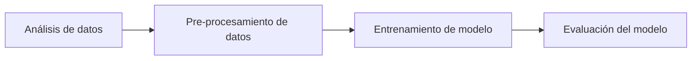
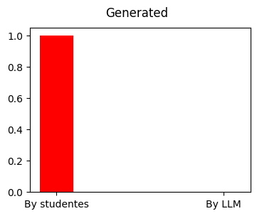
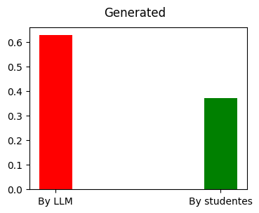

# Detectar texto generado con Inteligencia Artificial (LLM)

***Martín Cogo Belver***  

***Inteligencia Artificial II - Cursado 2023***

***Informe final***

***Facultad de Ingeniería Universidad de Cuyo***

## Introducción

Este informe se lleva a cabo como trabajo final integrador para la materia Inteligencia Artificial 2 de la facultad de ingeniería UNCUYO.

El objetivo planteado de este trabajo es la utilización de modelos de machine learning, enseñados durante el dictado de la materia, para la resolución de un problema a elección. Para este trabajo final se ha decidido que el trabajo se basara en un [Desafío] propuesto en [Kaggle], una pagina web para realizar competencias de resolución de problemas relacionados con la ciencia de datos. 

El desafió es un problema de clasificación de texto donde se debe detectar si ha sido generado por IA (Inteligencia Artificial) o por humanos. Entonces, con el fín de resolver este problema, utilizare el conjunto de datos provisto por el [Desafío] y los modelos basados en **redes neuronales**. 

### Indice:
- [Marco Teórico](#marco-teórico)
- [Diseño experimental](#diseño-experimental)
- [Conclusión](#conclusión)
- [Alcance](#alcance)
- [Referencias Bibliográficas y librerías](#referencias-bibliográficas-y-librerías)

## Marco Teórico

Para el experimento utilizare lo que se conoce como NN(Neural Network) o MLP(Multilayer preceptron). [Dive into deep learning].

### Justificación de función de activación
Las funciones de activación, según [Dive into deep learning], deciden cuando una neurona debe activarse calculando la suma de pesos y añadiendo un sesgo. Existen diferentes funciones de activación y la mayoría quitan la linealidad al modelo.

Para este proyecto se ha elegido la función de activación **ReLU**. Esta función a pesar de su simplicidad tiene un buen rendimiento y se define como
$$ \text{ReLU}(x) = \text{max}(x,0)$$

Básicamente toma todos los valores negativos y los convierte a 0.

Además para la neurona de salida, al tratarse de una clasificación binaria de clases, hemos utilizado la función de activación **sigmoid** que tiene la propiedad de devolver valores entre 0 y 1
$$\text{sigmoid}(x)=\frac{1}{1+\text{exp}(-x)}$$

### Justificación de función de perdida
La función de perdida indica que tanto error cometido por la inferencia realizado por el modelo en durante el entrenamiento, el valor que devuelve está función es aquel sobre el cual los algoritmos de optimización buscan reducir a 0.

Al tratarse de un problema de clasificación binaria se decidió utilizar la función de perdida [Binary Cross Entropy](https://keras.io/api/losses/probabilistic_losses/)

### Justificación de método de optimización
Como método de optimización se ha elegido el algoritmo [**Adam**](https://keras.io/api/optimizers/adam/), el cual se trata de un método de gradiente estomático descendente basado en la estimación adaptativa de momentos de primer y segundo orden.
### Concepto de épocas de entrenamiento y tamaño de batch
La cantidad de **épocas** de entrenamiento indica la cantidad de veces que el modelo vera el conjunto de datos de entrenamiento completo.

El **tamaño de batch** indica la cantidad de instancias que se muestran al modelo antes de realizar una actualización de parámetros durante el proceso de optimización.

La asignación de un valor a ambos parámetros depende del problema a resolver y se realiza mediante la experimentación. Ambos parámetros afectan notablemente la capacidad de aprendizaje de los datos durante el entrenamiento.

### Proceso de Tokenización de texto
El termino **Token** se refieren a la unidad atómica de un texto, la cual se constituye a través de decisiones de diseño. 

La **Tokenización** se refiere al proceso que se realiza al transformar un texto en una colección de *Tokens*.

Para realizar este proceso existen diferentes algoritmos como :
1. Rule-Based Tokenization
2. Whitespace-Based Tokenization
3. Regular Expression-Based Tokenization
3. Byte-Pair Encoding (BPE) Tokenization
4. Finite State Machine-Based Tokenization

### Representación de texto con vectores
- **Bag of Words**: Representación vectorial de un documento basada en la presencia o frecuencia de palabras, sin tener en cuenta su orden. Cada palabra se convierte en una dimensión en un vector.
- **Embeddings**: Representaciones vectoriales de palabras o frases que capturan relaciones semánticas y similitudes en un espacio semántico. Ofrecen una representación más densa y contextual del significado de las palabras.
### Proceso de Normalización

Según [Art of feature engineering], el proceso de escalamiento o normalización de atributos busca facilitar la inferencia de relaciones entre ellos colocándoos todos en una escala relativa para facilitar su comparación.

Este proceso es importante a la hora de trabajar con modelos cuyo entrenamiento está basado en algoritmos de gradiente descendente debido a dos posibles problemas que pueden surgir:

#### Gradiente desvaneciente 
**Gradiente Desvaneciente**: Es el problema en el entrenamiento de redes neuronales donde los gradientes se vuelven muy pequeños en capas profundas, dificultando el aprendizaje efectivo de las capas cercanas a la entrada.

#### Explosión del gradiente
**Explosión del Gradiente**: Es el problema opuesto al gradiente desvaneciente, donde los gradientes se vuelven extremadamente grandes en capas profundas, causando inestabilidad numérica y complicando el entrenamiento del modelo.

### Curva ROC
A partir de lo leído en [Imbalanced Classification with Python]:

#### ROC Curve
La ROC curve (**R**eceiver **O**perating **C**haracteristic curve) es un gráfico que resume el rendimiento de un modelo de clasificación binaria basándose en la clase positiva o mayoritaria,
El eje x indica la tase de Falsos Positivos y el eje y la tasa de Verdaderos Positivos

$$
\text{TruePositiveRate} = \frac{\text{TruePositive}}{\text{TruePositive} + \text{FalseNegative}}
$$
$$
\text{FalsePositiveRate} = \frac{\text{FalsePositive}}{\text{FalsePositive} + \text{TrueNegative}}
$$

**ROC AUC** (Área bajo la curva ROC): es una métrica que cuantifica la capacidad discriminatoria de un modelo. Esta se calcula a partir del area bajo la  curva ROC y un valor más alto indica un mejor rendimiento.

#### PR Curve
La curva de precision-recall es una gráfica que evalúa el rendimiento del modelo basándose en tanto la clase mayoritaria como minoritaria. En el eje y se gráfica la precisión y en el eje x la recuperación.
$$
\text{Precision} = \frac{\text{TruePositive}}{\text{TruePositive} + \text{FalsePositive}}
$$
$$
\text{Recall} = \frac{\text{TruePositive}}{\text{TruePositive} + \text{FalseNegative}}
$$
**ROC AUC_PR** (Área bajo la curva de precisión-recuperación): Es una métrica relacionada con problemas de clasificación des-balanceados, evalúa la precisión y recuperación(recall) del modelo a diferentes umbrales de clasificación.

## Diseño Experimental

Para esta face, principalmente seguí el siguiente workflow de Machine Learning.

### Obtención de datos

Según la descripción sobre el conjunto de [datos] del [desafío]:
- El conjunto de datos esta compuesto por 10,000 ensayos, algunos escritos por estudiantes y otros escritos por large language models (LLMs).
- Todos los ensayos fueron escritos con 7 consignas, y para cada una de ellas se le brindado al estudiante un textos fuentes en formato Markdown. Aun que estos textos pueden o no haber sido brindados a los LMM para la generación.
- Solamente 2 de las 7 consignas se han incluido en el conjunto de datos de entrenamiento. Probablemente se desee generar más ensayos como datos de entrenamiento.

Los datos brindados por el concurso presentan un des-balance severo de clases.

      generated  
      by Studentes    1375  
      by LLM       3  

Según lo leído en [Imbalanced Classification with Python] existen técnicas y métricas que se pueden utilizar con conjuntos de datos des-balanceados. Pero, aun así, debido al gran des-balance que hay en el conjunto de entrenamiento es imposible obtener un modelo que pueda generalizar bien con tan pocos ejemplos de la clase minoritaria. 

Generar datos nuevos con LLM's en este caso no es trivial. Esto se debe a los aranceles que se deben pagar para tener acceso a LLM's pre-entrenadas que permitan generar nuevas instancias para el entrenamiento. También se evaluó la posibilidad de realizar un despliegue de un LLM open source "llama-2" en un equipo de manera local pero la cantidad de recursos computacionales necesarios para su funcionamiento excedía los disponibles.

Como solución a este inconveniente, se decidió utilizar un [nuevo conjunto de datos] generado y puesto a disposición por uno de los participantes de la competencia.

### Análisis de Datos de Entrada

Se puede intuir que el [nuevo conjunto de datos] posee una distribución de probabilidad de sus datos diferente a la de el conjunto original de [datos] del [desafío], por lo que, la mejor solución al problema planteado debe estar implementada con un modelo con buena capacidad de generalización.

      generated      
      1    46203
      0    27370

### Pre-procesamiento de datos

Según lo leído en [Feature Engineering for Machine Learning] y [Art of feature engineering], para el pre-procesamiento de **texto** hay varias técnicas para trasformar texto en representaciones vectoriales. Su elección, depende de la cantidad de texto de cada instancia del conjunto de datos y el nivel de granularidad con el que se entrena el modelo, es decir, si se entrena con palabra, oración, párrafo o documentos.

Dadas las características del problema, se ha decidido que se utilizara  un [embedding] para la representación vectorial de cada instancia o documento en el conjunto de datos. Para realizar esta transformación, se realiza el procedimiento con los siguientes pasos:
- [Separación en conjunto de entrenamiento y de prueba](#separación-en-conjunto-de-entrenamiento-y-conjunto-de-prueba)
- [Tokenization](#tokenización)
- [Limpieza de datos](#limpieza-de-datos)
- [Creación de Embeddings](#representación-vectorial-embeddings)
- [Inferencia de nuevas características](#inferencia-de-algunos-atributos-extra)
- [Normalización](#normalización-del-conjunto-de-datos)

#### Separación en conjunto de entrenamiento y conjunto de prueba.

El [desafío] pone a disposición de los participantes un conjunto de datos de entrenamiento compone el 10% del conjunto de datos total. Del 90% restantes, el 46% del conjunto de datos se utiliza para calcular el puntaje publico y un 56% para la puntaje privado.

Para el entrenamiento de un modelo de machine learning se acostumbra la separación del conjunto de datos en un 70% de entrenamiento y 30% de prueba. Pero, siguiendo en las proporciones utilizadas en el [desafío], se decidió realizar una separación de 40% para entrenamiento y 60% para prueba del conjunto de datos.

#### Tokenización

El primer pazo para realiza entrenamiento de un modelo con texto es realizar un proceso de [tokenización](#tokenización). Tomando inspiración del siguiente notebook referenciado en la competencia [Train your own Tokenizer], se decidió crear y entrenar un tokenizador utilizando la librería transformers de HuggingFace [Tokenizers]. Este tokenizador esta basado en el algoritmo [Byte-Pair Encoding Tokenizer](https://huggingface.co/learn/nlp-course/chapter6/5?fw=pt), que tiene propiedades que resultan útiles en nuestro problema.

Propiedades:
- ***Adaptabilidad al Vocabulario***:
    El BPE se destaca por su capacidad para adaptarse al conjunto de datos construyendo un vocabulario específico a partir de las subunidades más frecuentes. A diferencia de algunos tokenizadores fijos, como el basado en palabras, el BPE puede ajustar dinámicamente su vocabulario según la complejidad del texto.
- ***Manejo Efectivo de OOV y Palabras Raras***:
    El BPE aborda eficazmente las palabras fuera del vocabulario predefinido y las palabras raras mediante la descomposición en subunidades que ya están en el vocabulario. Esto lo distingue de tokenizadores que pueden tener dificultades con palabras poco frecuentes o desconocidas.

Cadena de entrada al tokenizador:   
      "Martín's bag"  
Lista de salida con cada Token:  
      ['Ġmartin', "'s", 'Ġbag']  

#### Limpieza de datos

Según el libro [Feature Engineering for Machine Learning], una practica común para limpieza de datos de texto es realizar una eliminación de palabras que no aportan información significativa al modelo debido a su frecuencia de aparición, estas palabras se denominan ***stopwords***. Para hacer este proceso de eliminación se utilizo el conjunto de [stop words] provistos por la librería [Natural Language Toolkit](https://www.nltk.org/index.html). 

Ejemplo de stopwords:
      ['i',
      'me',
      'my',
      'myself',
      'we',
      'our',
      'ours',
      'ourselves',
      'you',
      "you're",
      "you've",
      "you'll",
      "you'd",
      'your',
      'yours',
      'yourself',
      'yourselves',
      'he',
      'him',
      'his',
      'himself',
      'she',
      "she's",
      'her',
      'hers',
      ...
      "weren't",
      'won',
      "won't",
      'wouldn',
      "wouldn't"]

#### Representación vectorial (Embeddings)

La técnica para crear representaciones vectoriales de texto con embeddings se realiza mediante una familia de algoritmos que en función del texto tokenizado crea un espacio vectorial para cada palabra. En este trabajo se eligió un modulo basado en la familia de algoritmos [word2vec], pero existen otros.

Como este modulo solo permite crear una representación vectorial solo por palabra, se decidió utilizar otro modulo de gensim llamado [doc2vec] que permite crear representaciones vectoriales para **documentos completos**. Además, a diferencia de word2vec, permite y realizar **inferencia de vectores** para nuevos documentos no han sido vistos durante la face de entrenamiento. Esto resulta especialmente util para el conjunto de datos de prueba es totalmente desconocido.

Se decidió que la cantidad de componentes o atributos de los embedding generados sería 100 ya que es una cantidad suficiente como para representar características de un documento y la elección de otra cantidad requeriría un análisis y experimentación adicional que no se ha llevado a cabo en este trabajo pero que como parte de un futuro alcance.
      
#### Inferencia de algunos atributos extra

Adicionalmente, se realizo una fase de inferencia de atributos de cada texto que se presupone que se pierden después de la transformación del texto a embedding, estos a tributos son:

- token_num: cantidad de tokens.
- sent_num: cantidad de oraciones.
- punct_sym: cantidad de símbolos de puntuación como puntos y comas.
- apostrof_sym: cantidad de apostrofes.
- unk_num: cantidad de tokens desconocidos en el texto.(palabras que no forman parte del vocabulario)

#### Normalización del conjunto de datos

Como parte del pre-procesamiento es importante realizar una normalización de los datos, para evitar problemas de [gradiente desvaneciente](#gradiente-desvaneciente) o la [exploción del gradiente](#explosi%C3%B3n-del-gradiente). Por eso, por cada vector se dividió sus componente por su modulo de tal manera que cada enbedding se convierta en un vector con norma uno. Adicionalmente, se agrego la norma del vector como atributo, para que la información relativa al tamaño de cada vector no se pierda.

***Vector de 100 elementos con sus valores normalizados.***  
      
            [0.024149.-0.012406.-0.214346.0.064996,0.081732,0.050830,-0.042659,...,-0.113359,0.072855,0.250193]  

Finalmente se tomo todos los otros atributos inferidos y el modulo de cada vetor y se le aplico normalización max-min, con el fín de que los valores quedaran entre 0 y 1.

### Entrenamiento

Para el entrenamiento se ha utilizado la técnica de **k-folding** con k=10 que es recomendado en la bibliografía y permite un entrenamiento menos sesgado y mejor generalización del por parte del modelo. 
Aún que, al tratarse de un conjunto de datos des-balanceados, se debe utilizar [StratifiedKFold] para evitar problemas al crear los folds donde algún fold se queda sin instancias de alguna de las clases del conjunto de datos. Para evitar este problema [StratifiedKFold] genera folds que respeten la distribución de datos inicial.

Como framework para facilitar el entrenamiento y la definición de la arquitectura de la red neuronal se ha utilizado la librería [Keras].

Para decidir el tamaño de la arquitectura se realizarón varias pruebas con diferentes tamaños y se llego a la conclusión de que el tamaño influye directamente en la cantidad de epocas nesesarias para generar overfitting sobre los datos pero, en principio, la capacidad de aprendizaje del modelo no está limitado por el tamaño de la arquitectura.

Para seleccionar la cantidad de épocas durante las cuales se entrenaría el modelo se ja tenido en cuenta que el entrenamiento se realiza 10 veces con diferentes conjuntos de datos debido ala utilización de la técnica **10-folding**. Por lo que epochs=1, implica entrenar el modelo durante 10 épocas con diferentes datos.

Arquitectura:
- Arquitectura con una capa de entrada con la misma cantidad de neuronas que la cantidad de atributos.
- Una capa oculta con 1000 neuronas y función de activación relu.
- Una cap de salida son sigmoide para que la salida este entre 0 y 1.

Metricas y optimizador:
- Como optimizador utilizo el algoritmo adam.
- para la función de perdida binary cross entropy.
- como métrica adicional el valor AUC que representa el area bajo la curva ROC.

Epocas y batch:
- 1 epoca que equivale a entrenar 10 veces. una vez con cada uno de los 10 fold.
- un batch size de 100, es pequeño por lo que los pesos del modelo se actualizan varias veces durante una sola época.

### Verificación del rendimiento del modelo

#### Métricas

Para evaluar el rendimiento del modelo se ha elegido las métricas [ROC AUC](#roc-auc) y [ROC AUC PR](#roc-auc-pr). Además de que son las utilizadas en el [desafío], estas métricas tienen propiedades que sirven para el problema a resolver.

- Según el libro [Imbalanced Classification with Python], estas métricas son aparte del conjunto **Ranking Metrics** las cuales tienen la característica de no asumir que la distribución de los datos en el conjunto de entrenamiento son los mismo que tendrá el conjunto de dato no visto.
- Se utilizan en casos donde se presentan conjuntos de datos des-balanceados ya que se basan en las métricas precition y recall.
- El area bajo las curvas ROC es un valor que puede utilizarse para comparar el rendimiento de modelos entre sí. 

#### Resultados del entrenamiento

Al evaluar el modelo sobre el conjunto total de entrenamiento obtenemos este resultado:

Se puede ver que el modelo fue capaz de aprender gran parte de los datos y al realizar una inferencia obtiene un valor de ROC AUC y ROC AUC PR alto.

#### Resultados de inferencia

Finalmente se realizo una predicción sobre el conjunto de datos de prueba dando como resultado un valor muy altos lo cual, bajo una primera impresiones, supone un gran rendimiento del modelo.

Pero a pesar de su buen rendimiento con los datos de prueba al realizar inferencias sobre los datos de prueba del [desafío] podemos notar que el rendimiento del modelo es notablemente más bajo.

El puntaje privado es el rendimiento del modelo sobre el 54% del conjunto de datos de prueba.
El puntaje publico es el rendimiento del modelo sobre el otro 46% del conjunto de datos de prueba.

## Conclusión

Si bien el rendimiento de la red neuronal más sencilla que podemos construir función bien para realizar la clasificación de textos en el conjunto de datos seleccionado para entrenamiento. Podemos notar que existe una notable dificultad a la hora de realizar predicciones con los datos de prueba del [desafío]. Es decir, que el modelo no es capaz de generalizar lo suficientemente bien. 

Una posible explicación para este caso es que el conjunto de datos de entrenamiento tiene una distribución de probabilidad muy diferente al que tiene el conjunto de prueba del desafío. Si esto es así, es necesario utilizar modelos más complejos que permitan mejor generalización, por ejemplo CNN,RNN, transformes o modelos de procesamiento de lenguaje pre-entrenados.

### Alcance

Por lo investigado y las soluciones propuestas por los participantes del concurso, las implementaciones que obtuvieron pontajes más altos al realizar predicciones sobre el conjunto de pruebas del [desafío]
han sido aquellas que utilizaban modelos basados en transformes pre-entrenados como BERT, distilBERT o distilroBERTa. El entrenamiento o fine-tunning de este tipo de modelos exige recursos de computo que excede los disponibles de manera gratuita en [Google Colab](https://colab.research.google.com/). Se realizo un intento de entrenamiento de BERT en Google Colab, pero debido a que la primera época de entrenamiento tardo aproximadamente 45 minutos, se concluyo en no utilizarlo en este proyecto.

## Referencias Bibliográficas y Librerías

### Fuentes Primarias

- [Imbalanced Classification with Python]
- [Feature Engineering for Machine Learning]
- [Dive into deep learning]
- [Art of feature engineering]

[Imbalanced Classification with Python]:https://machinelearningmastery.com/imbalanced-classification-with-python/

[Feature Engineering for Machine Learning]:https://www.oreilly.com/library/view/feature-engineering-for/9781491953235/

[Dive into deep learning]:https://d2l.ai/

[Art of feature engineering]:https://artoffeatureengineering.com/

### Notebooks

- [Train your own Tokenizer]

[Train your own Tokenizer]:https://www.kaggle.com/code/datafan07/train-your-own-tokenizer

### Librerías y frameworks

- [Pandas]
- [Numpy] 
- [Matplotlib]
- [Stopwords]
- [word2vec]
- [Doc2vec]
- [StratifiedKFold] 
- [Resample]
- [Metrics module]
- [Tokenizers]
- [Transformers]
- [Keras]

[word2vec]:https://radimrehurek.com/gensim/models/word2vec.html
[Datos]:https://www.kaggle.com/competitions/llm-detect-ai-generated-text/data
[Kaggle]:https://www.kaggle.com/
[Desafío]:https://www.kaggle.com/competitions/llm-detect-ai-generated-text  
[Nuevo conjunto de datos]:https://www.kaggle.com/datasets/thedrcat/daigt-v4-train-dataset
[pandas]:https://pandas.pydata.org/
[numpy]:https://numpy.org/
[matplotlib]:https://matplotlib.org/
[stopwords]:https://www.nltk.org/search.html?q=stopwords
[Doc2vec]:https://radimrehurek.com/gensim/models/doc2vec.html
[StratifiedKFold]:https://scikit-learn.org/stable/modules/generated/sklearn.model_selection.StratifiedKFold.html
[Resample]:https://scikit-learn.org/stable/modules/generated/sklearn.utils.resample.html
[metrics module]:https://scikit-learn.org/stable/modules/model_evaluation.html
[Tokenizers]:https://huggingface.co/docs/tokenizers/index
[Transformers]:https://huggingface.co/docs/transformers/index
[Keras]:https://keras.io/